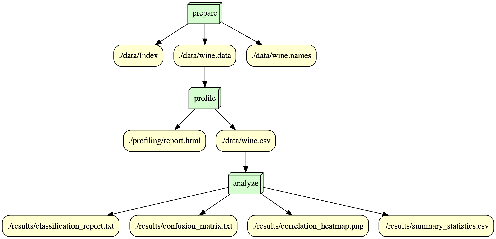

# IS 477 Fall 2023 Final Project - Subin Pradeep

## Overview
The Wine Recognition dataset comprises chemical analysis results of wines from three different cultivars in the same Italian region. Each wine is characterized by 13 continuous attributes, including alcohol content, malic acid, and color intensity. Hence there are 13 features and 1 target (the type of wine). The dataset is often utilized for classifier comparison and with no missing values, it serves as a well-posed problem for testing and evaluating new classifiers. For my project, I will be evaluating the performance of a multinomial logistic regression model when trying to predict the target variable using the available 13 features. 

## Analysis
The classification report reveals excellent performance in predicting the wine cultivar classes (1, 2, and 3) based on the feature attributes described in the Wine Recognition dataset. The precision, recall, and F1-score metrics for each class indicate high accuracy, with class 1 achieving perfect precision and recall. The overall accuracy stands at 97%, showcasing the model's effectiveness in discriminating between the three types or classes of wine. The model's consistent performance underscores its reliability for precise wine classification grounded in chemical composition.

## Workflow


## Reproducing
To reproduce the results in this repository, refer to the following steps:
  1. Create a new folder on your desktop
  2. Open a local instance of your terminal/command prompt and navigate to the folder you just created by typing the following command in terminal:
     ``` cd "path_to_your_folder" ```
  3. Once within your new folder on terminal, run the following terminal command. This will create a clone of this repository to the new folder you had created.
     ```git clone https://github.com/SubinPradeep/is477-fall2023-final-project.git```
  4. Open the cloned folder in your visual studio code instance.
  5. Active the virtual environment by running the following terminal command (make sure you are within the project folder's directory):
     ```source venv/bin/activate```
  6. Next run the following command in terminal to download the required dependencies:
     ```pip install -r requirements.txt```
  7. Your local environment is now setup to run the necessary scripts for reproduction!
  8. To run the first script use the following terminal command (make sure you are using a bash instance of the terminal):
     ```snakemake --core 1 prepare```
  9. Next, run the following:
    ```snakemake --core 1 profile```
  10. Finally, run the following:
    ```snakemake --core 1 analyze```
  11. Congratulations! You have successfully reproduced the desired analysis! All generated outputs can be found with the 'results' and 'profiling' directory! 
  
## Licenses
  Two licenses are used in this repository:
  1. MIT license
  2. CC-By-4.0 License

  I chose the MIT license for my licensing. This license provides others with the ability to do anything they want with my project with free of       
  charge. I chose this license due to the fact that is the least complicated when it comes to copyright issues and because I don't mind my work being 
  reproduced or recreated. 

  I choose the Creative Commons Attribution 4.0 International License (CC BY 4.0) as it allows others to copy, distribute, display, and perform the work and derivative works based upon it. The necessary author attribution can be found within the citations of this file. 
  

## Citations
Ding, F., Hardt, M., Miller, J., & Schmidt, L. (2021). Retiring Adult: New Datasets for Fair Machine Learning. ArXiJabs/2108.04884
https://cps.ipums.org/cps/citation.shtml https://www.ipums.org/about/terms
https://docs.github.com/en/repositories/managing-your-repositorys-settings-and-features/customizing-your-repository/licensing-a-repository#choosing-the-right-licensehttps://opendefinition.org/licenses/
https://archive.ics.uci.edu/dataset/2/adult https://github.com/socialfoundations/folktables
